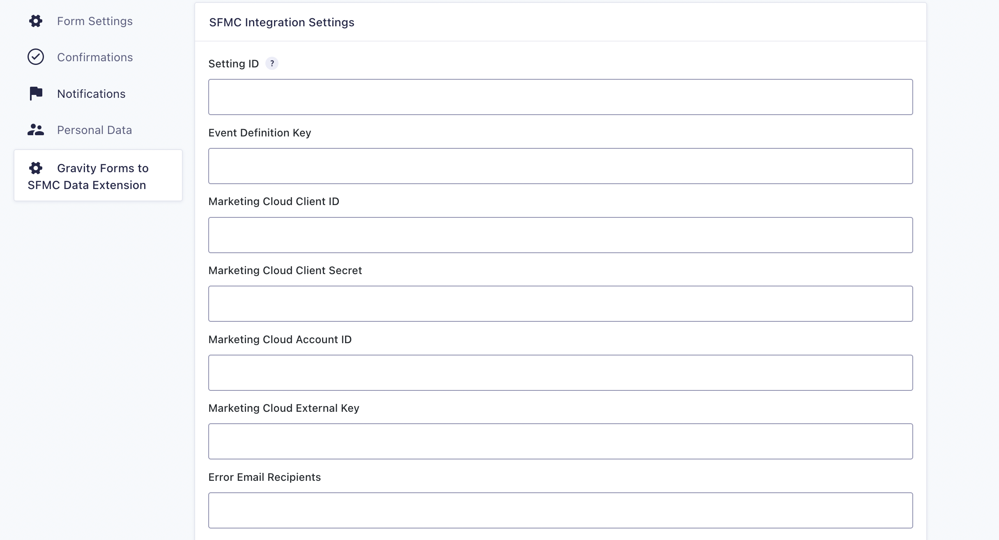

# Gravity Forms to SFMC Data Extension Add-On

Submit form entries to a SalesForce Marketing Cloud Data Extension via Gravity Forms.
This plugin uses Salesforce Marketing Cloud Journey Builder REST API endpoints. The gravity form entry data is pushed to Data Extension through Journey Builder.
Form submission fires the entry event that initiates the journey.

Gather following information in order to set up the integration.

For more details and integration steps please [check this article](https://rtcamp.com/blog/gravityform-to-salesforce-data-extension/)

## Installation Guide

* Clone this repo under the `wp-content/plugins/` folder of WordPress.
* Activate the plugin.

## Author

* **[rtCamp](https://rtcamp.com)**

## Contributors

* **[Kiran Potphode](https://github.com/kiranpotphode)**

## WP Core and Plugins Auto-Update Reporting

**PM:** [sohel.mistry@rtcamp.com](mailto:sohel.mistry@rtcamp.com)  
**Devs:** [abhishek.kumar@rtcamp.com](mailto:abhishek.kumar@rtcamp.com)

## License :page_with_curl:

This project is licensed under the GPL2 License - see the [LICENSE.MD](LICENSE.MD) file for details.
## Does this interest you?

